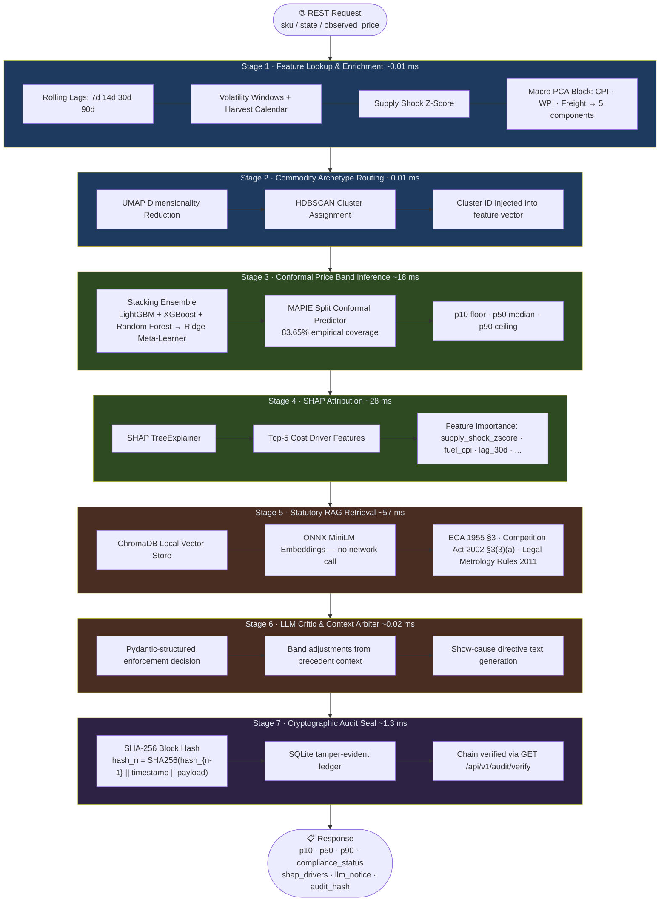
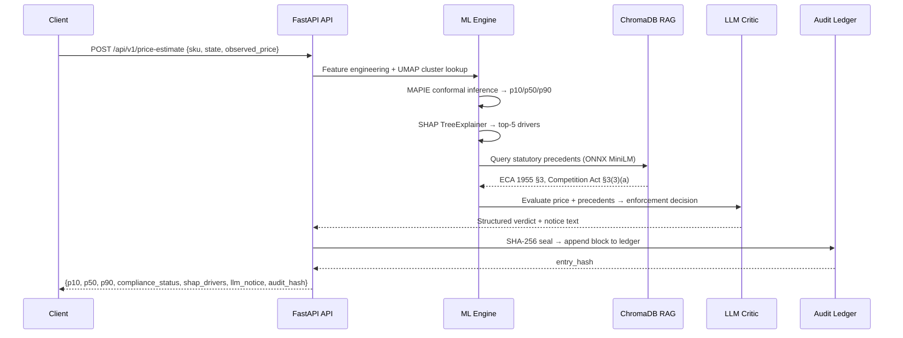

# CASPER-Gov: System Architecture

> AI-Powered Commodity Price Surveillance & Enforcement Platform

---

## 7-Stage End-to-End Pipeline

---

## Platform Component Map

```mermaid
graph LR
    subgraph Ingestion
        A1[Agmarknet API Client]
        A2[Macro Scrapers: FRED · World Bank]
        A3[Point-in-Time Temporal Splits]
    end

    subgraph ML["ML Core"]
        B1[Macro PCA]
        B2[UMAP + HDBSCAN Clustering]
        B3[LightGBM Quantile p10/p50/p90]
        B4[MAPIE Conformal Calibration]
        B5[Isolation Forest Anomaly Detector]
        B6[Chronos Zero-Shot Forecaster]
    end

    subgraph Intelligence["Legal Intelligence"]
        C1[ChromaDB ONNX Vector Store]
        C2[SHAP TreeExplainer]
        C3[Instructor + LLM Critic]
    end

    subgraph Enforcement["Enforcement Engine"]
        D1[SHA-256 Chained Audit Logger]
        D2[ReportLab PDF Notice Generator]
        D3[Cartel Collusion Network Graph]
        D4[UCB1 Policy Bandit Simulator]
    end

    subgraph API["FastAPI REST Layer"]
        E1["POST /api/v1/price-estimate"]
        E2["GET  /api/v1/price-bands"]
        E3["GET  /api/v1/monitoring"]
        E4["GET  /api/v1/anomalies"]
        E5["POST /api/v1/enforce"]
        E6["POST /api/v1/enforce/pdf"]
        E7["GET  /api/v1/audit/logs"]
        E8["GET  /api/v1/audit/verify"]
        E9["GET  /api/v1/stats"]
        E10["GET  /health"]
    end

    subgraph Dashboard["Streamlit Command Center"]
        F1[Mandi+ Live Monitoring Tab]
        F2[Forecasting & Scenario Planning Tab]
        F3[Batch Risk Upload Tab]
        F4[Cartel Network Analysis Tab]
        F5[Audit Chain Viewer Tab]
        F6[PDF Notice Download]
    end

    Ingestion --> ML
    ML --> Intelligence
    Intelligence --> Enforcement
    Enforcement --> API
    API --> Dashboard
```

---

## Latency Profile (30-trial Monte Carlo Benchmark)

| Stage | Mean | p50 | p95 |
|-------|------|-----|-----|
| Stage 1: Feature Lookup | 0.01 ms | 0.00 ms | 0.00 ms |
| Stage 2: Cluster Routing | 0.01 ms | 0.00 ms | 0.00 ms |
| Stage 3: Conformal Inference | 17.98 ms | 16.97 ms | 17.73 ms |
| Stage 4: SHAP Attribution | 28.40 ms | 28.33 ms | 28.98 ms |
| Stage 5: Legal RAG Retrieval | 56.95 ms | 56.47 ms | 63.98 ms |
| Stage 6: LLM Critic | 0.02 ms | 0.02 ms | 0.04 ms |
| Stage 7: Cryptographic Seal | 1.32 ms | 1.00 ms | 2.70 ms |
| **⚡ Full E2E** | **104.67 ms** | **102.89 ms** | **115.35 ms** |

> Estimated throughput: **~10 evaluations/second** on a single CPU node (no GPU).

---

## Data Flow

---

## Statutory Legal Basis

| Statute | Section | Enforcement Use |
|---------|---------|----------------|
| Essential Commodities Act, 1955 | §3 | Price ceiling control orders |
| Competition Act, 2002 | §3(3)(a) | Anti-competitive cartel agreements |
| Legal Metrology (Packaged Commodities) Rules, 2011 | Rule 6 | Price declaration compliance |
| Consumer Protection Act, 2019 | §2(9) | Unfair trade practices |
